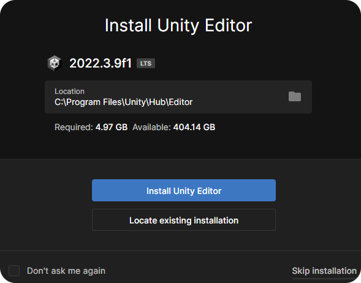

# Unity

## Installation (Windows)

* Télécharger [Unity Hub](https://unity.com/download).

<figure>
    
    <figcaption style="text-align: center;" class="green">Cliquer sur <i>Download for Windows</i>.</figcaption>
</figure>

* Installer Unity Hub.
* Lancer Unity Hub.
* Créer un compte gratuit.

<figure>
    
    <figcaption style="text-align: center;" class="green">Cliquer sur <i>Create account</i>.</figcaption>
</figure>

* Installer l'éditeur de Unity (Accepter les termes de la licence).

<figure>
    
    <figcaption style="text-align: center;" class="green">Cliquer sur <i>Install Unity Editor</i>.</figcaption>
</figure>

* Installer Visual Studio via l'ajout d'un module à l'éditeur.

<figure>
    
    <figcaption style="text-align: center;" class="green">Cliquer sur <i>Add modules</i>.</figcaption>
</figure>

* Paramétrer Visual Studio (une fenêtre s'ouvre suite à l'installation).

<figure>
    
    <figcaption style="text-align: center;" class="green">Cocher <i>Game development with Unity</i> et <b>décocher</b> sur la droite Unity Hub.</figcaption>
</figure>

## Création d'un nouveau projet

* Cliquer sur *Projects* > *New project*.
* Cliquer sur 2D et renseigner un nom et un chemin pour sauvegarder votre projet.

<figure>
    
    <figcaption style="text-align: center;" class="green">Cliquer sur <i>Create project</i> lorsque vous avez renseigné les informations de votre projet.</figcaption>
</figure>
