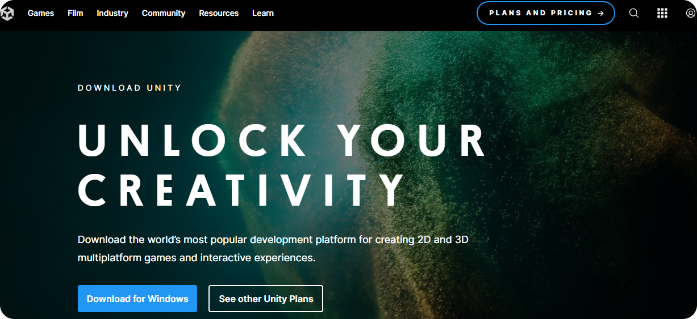
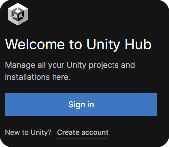
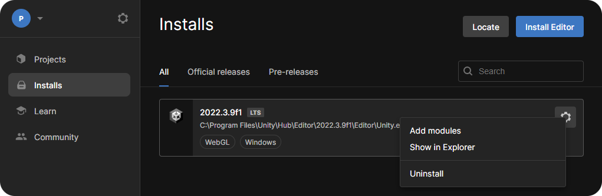

# Unity

## Installation

* Vidéo d'installation de Unity sous Windows 10 et 11 : https://www.youtube.com/watch?v=Kh_FD0Ypdhg
* Vidéo d'installation de Unity sous Ubuntu 22.04 : https://www.youtube.com/watch?v=JJDb2aeXlhA
* Vidéo pour configurer VS Code avec Unity sous Ubuntu (ou autres OS compatibles) : https://www.youtube.com/watch?v=iZ8r9y3AfBU (à partir de 10min35s)
* Vidéo pour installer Unity sous Mac : https://www.youtube.com/watch?v=dqJbCjPsqyg

## Exemple d'installation pour Windows 10 ou 11

* Télécharger [Unity Hub](https://unity.com/download).

     
    
    
<i>Cliquer sur Download for Windows</i>.

     

* Installer Unity Hub.
* Lancer Unity Hub.
* Créer un compte gratuit.

     
    
    
<i>Cliquer sur Create account</i>.

     

* Installer l'éditeur de Unity en version LTS (Accepter les termes de la licence).

     
    
    
Cliquer sur <i>Install Unity Editor</i>.

     

* Si Visual Studio Community n'a pas été installé via l'installation de l'éditeur, installer le en ajoutant un module à l'éditeur.

     
    
    
<i>Cliquer sur Add modules</i>.

     

* Paramétrer Visual Studio (une fenêtre s'ouvre suite à l'installation).

     
    
    
<i>Cocher Game development with Unity et <b>décocher</b> sur la droite Unity Hub.</i>

     

* Ajouter une licence à votre projet *Get a free personal license" via *Manage licenses*.

## Création d'un nouveau projet

* Cliquer sur *Projects* > *New project*.
* Cliquer sur 3D et renseigner un nom et un chemin pour sauvegarder votre projet.

     
    
    
<i>Cliquer sur Create project lorsque vous avez renseigné les informations de votre projet.</i>

     

